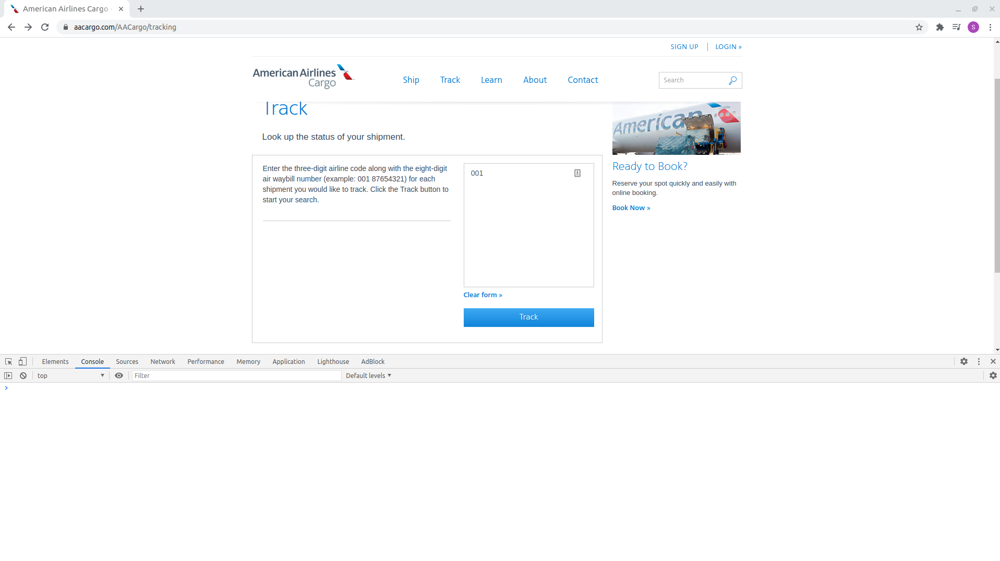

## Setup Guide ##

Requires: Python 3.7+

Install pipenv: `pip install pipenv`

Install dependencies: `pipenv install -r requirements.txt`

**Linux:**

Run the following command: `sudo apt-get install python3-tk python3-dev`

**Mac:**

Set environment variable `export AABOT_OS=macos`

Make sure terminal has permissions to control the computer. Go to `System Preferences > Security & Privacy > Accessbility`
and make sure the terminal that will be used to launch the server is selected.

### Configuration ###

Supported Environment Variables:

`AABOT_BROWSER_REFRESH_INTERVAL` - This is the amount of time between browser refreshes. After a certain period
of time the cookies go stale and requests start to fail. By default, refreshes happen every 15 seconds. This
can be adjusted using this environment variable. The interval is defined in seconds. For example, setting this
to 50 will trigger a browser refresh if 50 seconds have passed since the last refresh.

`AABOT_GUI_INTERVAL` - This is the amout of time of intentional delay between major GUI input. This delay exists
to allow for the previous GUI action to have taken effect, otherwise the next GUI interaction might fail. By default,
this interval is set to 0.05 seconds. The interval is defined in seconds. This can be adjusted to allow slower
machines more time process GUI events.

`AABOT_PRESERVE_CONSOLE_HISTORY` - If set to true, the console logs will not be deleted between request. This is
disabled by default to prevent the console log from getting infinitely big and consuming memory.

`AABOT_OS` - The operating system the server will be running on. Different OS have different key bindings. By default,
the OS is set to linux. Valid values are `linux` or `macos`.

### Starting Server ###

Before running the server make sure that python virtual env is running. If not, run the following `pipenv shell`

1. Start server by running `gunicorn -w 1 --threads 20 -b 0.0.0.0:5000 wsgi:app`
2. Open Chrome browser and maximize the window
3. Navigate to www.aacargo.com/AACargo/tracking
4. Open developers tools to `Console` tab, see image below:

## Notes ##

If the server takes a long time to respond, the connection will timeout after 30 seconds.
